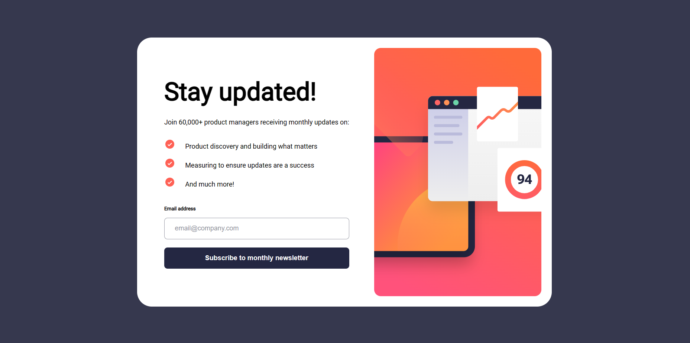
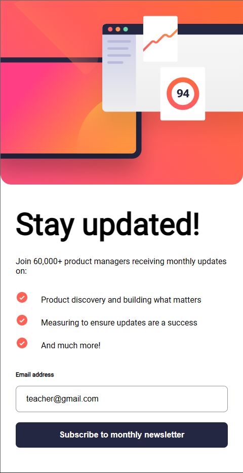
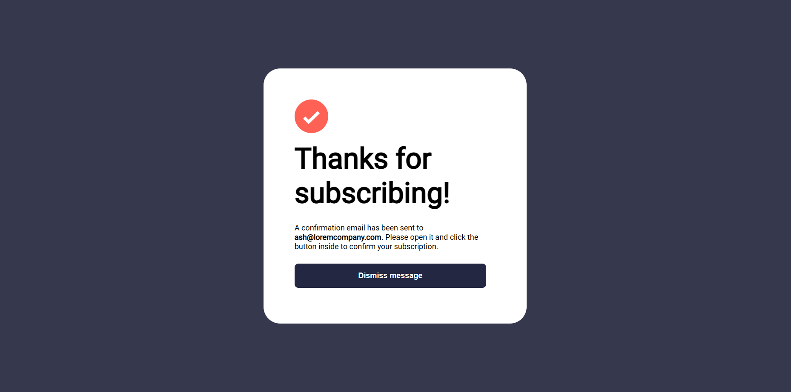

# Frontend Mentor - Newsletter sign-up form with success message solution

This is a solution to the [Newsletter sign-up form with success message challenge on Frontend Mentor](https://www.frontendmentor.io/challenges/newsletter-signup-form-with-success-message-3FC1AZbNrv). Frontend Mentor challenges help you improve your coding skills by building realistic projects.

## Table of contents

- [Overview](#overview)
  - [The challenge](#the-challenge)
  - [Screenshot](#screenshot)
  - [Links](#links)
- [My process](#my-process)
  - [Built with](#built-with)
  - [What I learned](#what-i-learned)
  - [Continued development](#continued-development)
- [Author](#author)

**Note: Delete this note and update the table of contents based on what sections you keep.**

## Overview

### The challenge

Users should be able to:

- Add their email and submit the form
- See a success message with their email after successfully submitting the form
- See form validation messages if:
  - The field is left empty
  - The email address is not formatted correctly
- View the optimal layout for the interface depending on their device's screen size
- See hover and focus states for all interactive elements on the page

### Screenshot






### Links

- Solution URL: [https://github.com/NguyenVanKhoa-CDTH19PMC/newsletter-sign-up.git](https://github.com/NguyenVanKhoa-CDTH19PMC/newsletter-sign-up.git)
- Live Site URL: [https://nguyenvankhoa-cdth19pmc.github.io/newsletter-sign-up/](https://nguyenvankhoa-cdth19pmc.github.io/newsletter-sign-up)

## My process

### Built with

- Semantic HTML5 markup
- CSS custom properties
- Flexbox
- Mobile-first workflow

### What I learned

Change the style of HTML elements used in the HTML DOM

```js
let email = document.getElementById("email");
document.getElementById("error").innerHTML = "Vailed email required";
email.style.borderColor = "red";
email.style.backgroundColor = "rgba(255, 0, 0, 0.084)";
email.style.setProperty("--abc", "red");
```

Responsive by media query

```css
@media screen and (max-width: 1440px) {
  .cover {
    width: 100%;
  }
  main {
    flex-direction: column;
    min-height: 100vh;
  }
}
```

### Continued development

Improve HTML, CSS and JavaScript skills

## Author

- Frontend Mentor - [@NguyenVanKhoa-CDTH19PMC] (https://www.frontendmentor.io/profile/NguyenVanKhoa-CDTH19PMC)
- Github - [NguyenVanKhoa-CDTH19PMC] (https://github.com/NguyenVanKhoa-CDTH19PMC)
